# despliegue-app

- **Captura 1:** Tabla o documento con la arquitectura tecnológica seleccionada.
   
| Componente    | Tecnología        | Puerto | Función             |
| ------------- | ----------------- | -----: | ------------------- |
| Frontend      | React             |   8081 | Interfaz de usuario |
| Backend       | Java + Springboot |   8080 | API REST            |
| Base de datos | PostgreSQL        |   5439 | Persistencia        |

- **Captura 2:** Información del servidor Linux.

- **Captura 3:** Dirección IP de la máquina virtual.

- **Captura 4:** Docker funcionando correctamente.

- **Captura 5:** Primer contenedor ejecutado.

- **Captura 6:** Servicio web funcionando.

- **Captura 7:** Administración de los contenedores.

- **Captura 8:** Portainer funcionando.

- **Captura 9:** Administración del entorno Docker desde Portainer.

- **Captura 10:** Volumen creado.
- 
captura 10: 1. Crea el volumen:

- **Captura 11:** Prueba de persistencia.

- **Captura 12:** Dockerfile del frontend.
  

- **Captura 13:** Imagen Docker construida.

- **Captura 14:** Frontend funcionando dentro del contenedor.

- **Captura 15:** Dockerfile del backend.
- 
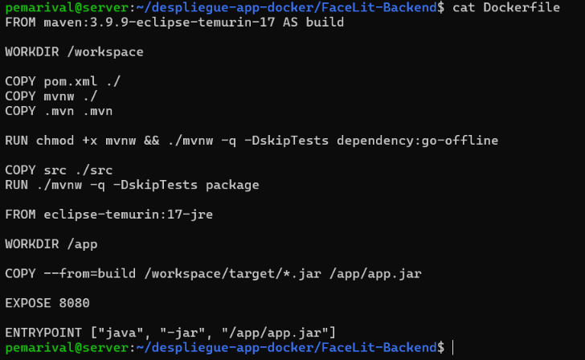

- **Captura 16:** Imagen del backend.
  
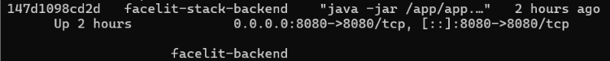

- **Captura 17:** Backend funcionando.
  
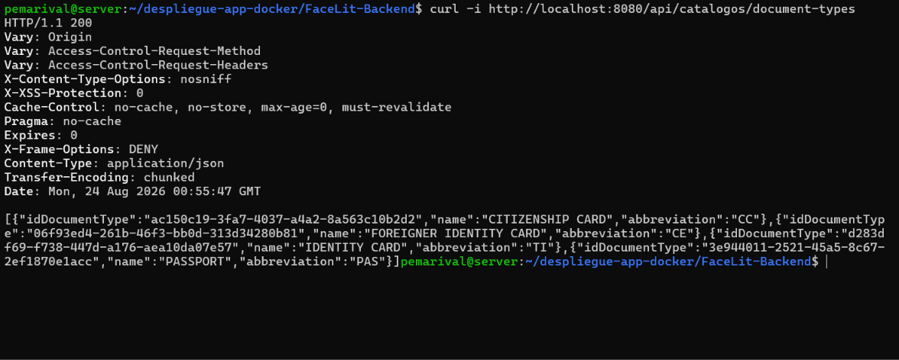
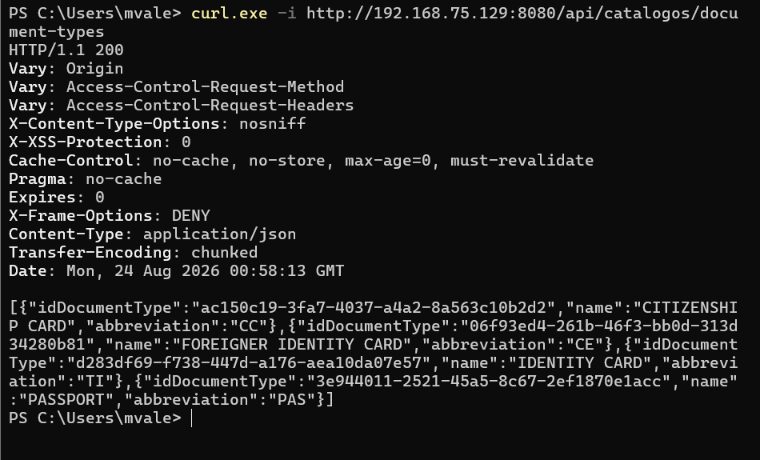

- **Captura 18:** Contenedor de base de datos funcionando.

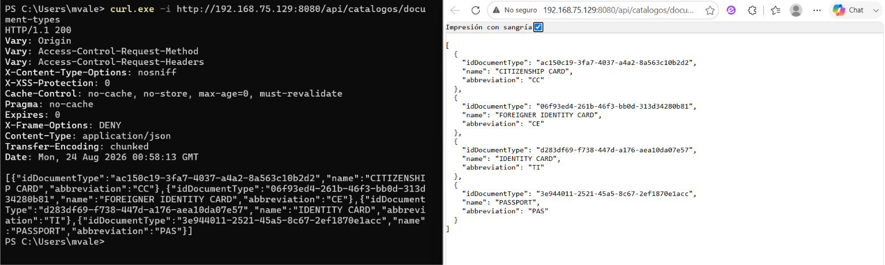

- **Captura 19:** Base de datos creada.

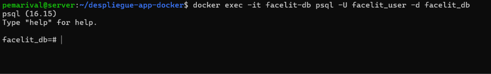

- **Captura 20:** Volumen asociado a la base de datos.

  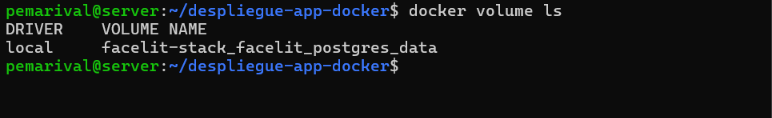

  
- **Captura 21:** Configuración de conexión.

  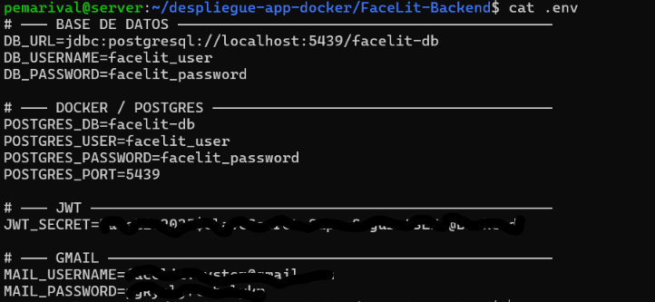

- **Captura 22:** Operación de lectura.

  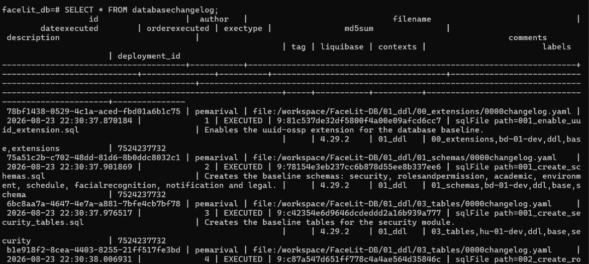

- **Captura 23:** Operación de escritura.

  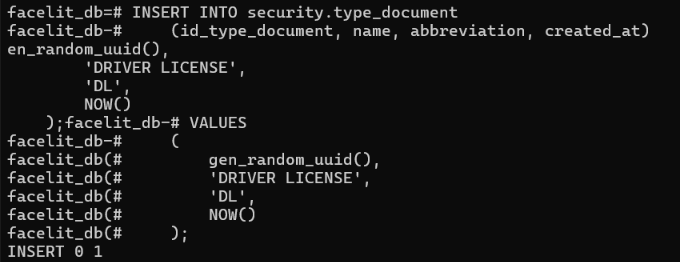
- **Captura 24:** Logs mostrando comunicación exitosa.
    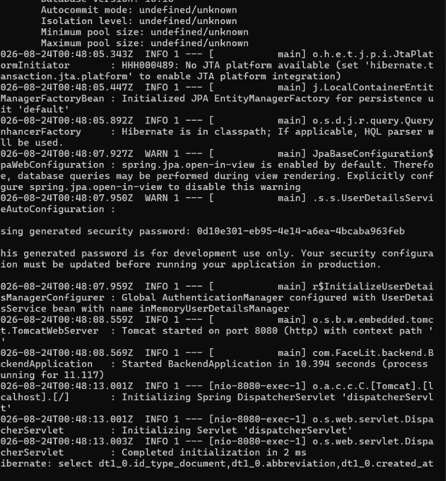
- **Captura 25:** Frontend funcionando.
    
- **Captura 26:** Solicitud del frontend hacia el backend.

- **Captura 27:** Respuesta recibida desde el backend.
- **Captura 28:** Aplicación completa funcionando.
- **Captura 29:** Archivo Docker Compose.
- 

- **Captura 30:** Todos los servicios funcionando.
- **Captura 31:** Servicios detenidos.

- **Captura 32:** Servicios recuperados.

- **Captura 33:** Servicios reconstruidos.
- **Captura 34:** Aplicación funcionando desde el equipo anfitrión.

**Captura 35:** Aplicación funcionando desde otro equipo de la intranet.
